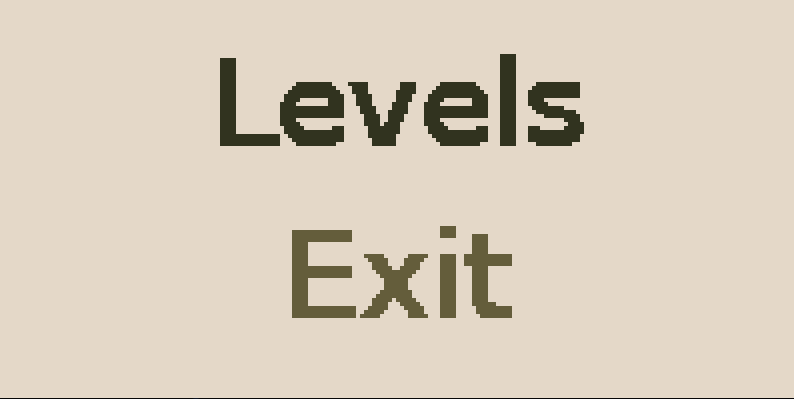
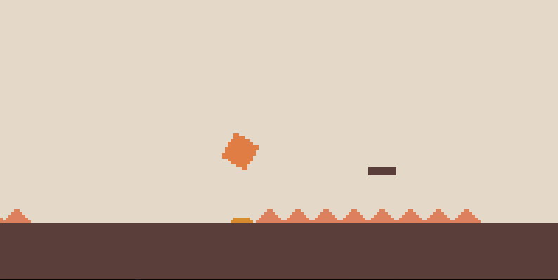
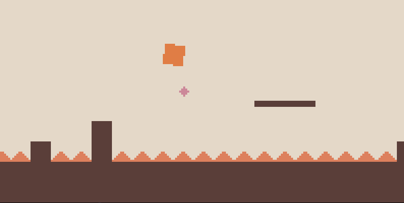

    

## LDTS_t10g01 - Minidash

MiniDash is a simple version of [Geometry Dash](https://geometrygame.org/), implemented using Java's Lanterna. We follow SOLID principles and integrate several programming patterns such as State, Game Loop and Visitor.

This project was developed by *Luís Barbosa* (up202303872), *Luís Gonçalves* (upXXXXXXXXX) and *Sofia Sousa* (up202303662) for LDTS 2024/25.

### IMPLEMENTED FEATURES

- **Blocks & Platforms** - Game elements used by the player to move and jump. Colliding with a block from the side causes the game to end.
- **Spikes** - Colliding with a spike will kill the player.
- **Boosts** - Colliding with a bost makes the player jump higher than normal. The player is forced to jump, even without jump button action.
- **Double jumpers** - Double jumpers give the player the option to jump mid-air.
- **Physics** - The above features require some realistic physics for jumping and collision detection.
- **Player rotation** - This required some non-trivial trigonometry and clever thinking.
- **Menus & Music**

    

    

    

### PLANNED FEATURES

We'd planned for some additional features if time was available, but time, of course, failed to obey us:
- Portals
- Gravity Inversion
- Color theme changing

### DESIGN

#### DRAWING AND INTERATING WITH GAME ELEMENTS

**Problem in Context**

Minidash follows an MVC structure. When we first created the LevelView, we intended to check the type of an element and render it accordingly. This, however, violated the open-closed principle, since adding more game elements would require modificating the `draw()` method of the LevelView. The same problem appeared again while creating the LevelController and the menu logic.

**The Pattern**

We have applied the **Visitor** pattern. This pattern makes a **visitor** visit a generic **element** through its **accept** method. Each of the subclasses of the element will then choose the appropriate handler in the visitor. For each new element, another method needs to be added in the visitor, but none of the existing ones are changed.

**Implementation**

The following figure shows how the pattern’s roles were mapped to the application classes.

These classes can be found in the following files (only a few are provided for brevity, all the others follow a similar structure):

- [Element](https://github.com/FEUP-LDTS-2024/project-t10g01/blob/master/src/main/java/com/t10g01/minidash/model/Element.java)
- [Block](https://github.com/FEUP-LDTS-2024/project-t10g01/blob/master/src/main/java/com/t10g01/minidash/model/Block.java)
- [ElementVisitor](https://github.com/FEUP-LDTS-2024/project-t10g01/blob/master/src/main/java/com/t10g01/minidash/model/ElementVisitor.java)
- [LevelView](https://github.com/FEUP-LDTS-2024/project-t10g01/blob/master/src/main/java/com/t10g01/minidash/view/LevelView.java)
- [LevelController](https://github.com/FEUP-LDTS-2024/project-t10g01/blob/master/src/main/java/com/t10g01/minidash/controller/LevelController.java)

**Consequences**

The use of the Visitor Pattern in the current design allows the following benefits:

- A clear separation between view, model and controller
- Not violating the open-closed principle
- It is now slightly more difficult to track the rendering of the elements since new interfaces were added and the visitor is not something to perceive at a first glance. These problems, though, are outweighed by the benefits, and the whole patter can easily be grasped if supported by some UML.

#### CREATING MENUS

**Problem in Context**

Menus were implemented incrementally in Minidash. At first, when only the main menu existed, it was represented by a MenuModel with a list of available options. When more menus were added, which required different MenuModels with a different set of options, we modified the constructor to require a list of available options. This, however, required classes that had nothing whatsoever to do with menus to decide which options to make available in a menu.

**The Pattern**

We have applied the **Factory Method**. This pattern has an abstract class that implements most of the logic but delegates the creation of one or more objects to its subclasses.

**Implementation**

We transformed the existing **MenuState** into an abstract class with the abstract method **createModel** and created three other classes to extend it: **MainMenuState**, **LevelMenuState** and **LevelCompleteState**.

These classes can be found in the following files:

- [MenuState](https://github.com/FEUP-LDTS-2024/project-t10g01/blob/master/src/main/java/com/t10g01/minidash/state/MenuState.java)
- [MainMenuState](https://github.com/FEUP-LDTS-2024/project-t10g01/blob/master/src/main/java/com/t10g01/minidash/state/MainMenuState.java)
- [LevelMenuState](https://github.com/FEUP-LDTS-2024/project-t10g01/blob/master/src/main/java/com/t10g01/minidash/state/LevelMenuState.java)
- [LevelCompleteState](https://github.com/FEUP-LDTS-2024/project-t10g01/blob/master/src/main/java/com/t10g01/minidash/state/LevelCompleteState.java)

**Consequences**

The use of the Factory Method in the current design has the following consequences:

- Better separation between different classes: the LevelController doesn't have to decide which options a menu should have - it suffices to choose a menu type and call its empty constructor.
- Some additional complexity which is far outwheighed by the benefits.

### TESTING

- Screenshot of coverage report.
- Link to mutation testing report.

### SELF-EVALUATION

- Luís Barbosa: 33%
- Luís Gonçalves: 33%
- Sofia Sousa: 33%
- Rubber Duck: 1%
