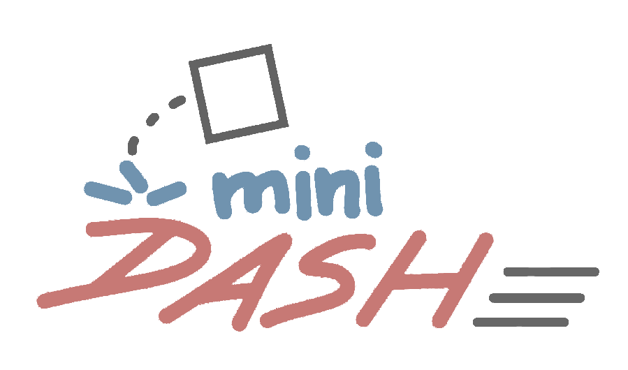
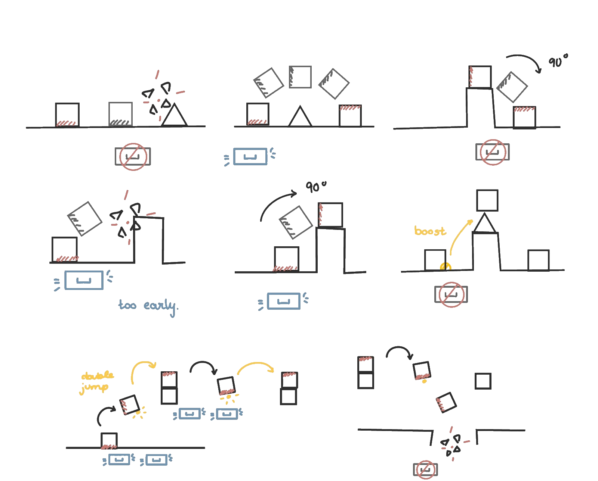

    

MiniDash is a simple version of [Geometry Dash](https://geometrygame.org/) implemented using Java's Lanterna. We follow SOLID principles and implement several programming patterns such as State, Game Loop and Visitor.

## Description

We intend MiniDash to be a simplified version of the original game. The player advances from left to right and and is allowed to jump. The game is composed of various elements:

- Blocks
    - platforms where the player can land
    - colliding with a block from the side causes the game to end
- Spikes
    - colliding with a spike causes the game to end
- Boosts
    - boosts force the player to jump
    - boost jumps are higher than normal jumps
- Double jumpers
    - the player may choose to jump mid-air if touching a double jumper

## Implementation

The game will have two different modes of operation: Menu and Level. We have implemented these two modes, and the logic of switching between them, using the State pattern. In order to separate game data, logic and rendering, we use the MVC pattern.

Since we are representing all of the game elements as a list of Colliders inside our Model, we faced the problem of drawing those elements without violating the Open-Closed principle. We implemented the Visitor pattern to solve that problem.